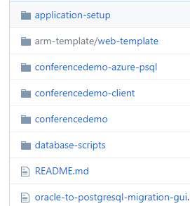
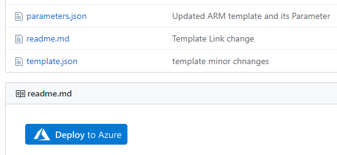

# Setting up the Oracle to PostgreSQL Migration Guide Sample Application
- [Setting up the Oracle to PostgreSQL Migration Guide Sample Application](#setting-up-the-oracle-to-postgresql-migration-guide-sample-application)
  - [Application Architecture](#application-architecture)
  - [Oracle Database ER Diagram](#oracle-database-er-diagram)
  - [Git repo structure](#git-repo-structure)
  - [Installing the Oracle database](#installing-the-oracle-database)
    - [Add the sample blobs](#add-the-sample-blobs)
  - [Installing the Application](#installing-the-application)
    - [Make sure your local Java and Maven environmental variables are set](#make-sure-your-local-java-and-maven-environmental-variables-are-set)
    - [Set your development application runtime environment variables](#set-your-development-application-runtime-environment-variables)
    - [Test the Java API](#test-the-java-api)
  - [Installing and running the Angular application locally](#installing-and-running-the-angular-application-locally)
    - [Summary](#summary)
  - [Create and configure your Azure resources](#create-and-configure-your-azure-resources)
    - [Run the ARM template](#run-the-arm-template)
    - [Capture the PostgreSQL configuration](#capture-the-postgresql-configuration)
  - [Set up your migration server and migrate the Oracle database to PostgreSQL](#set-up-your-migration-server-and-migrate-the-oracle-database-to-postgresql)
  - [Finish your Azure resource configuration](#finish-your-azure-resource-configuration)
    - [Update your secrets in Key Vault](#update-your-secrets-in-key-vault)
    - [Update your web application configuration settings with the Azure Key Vault secrets](#update-your-web-application-configuration-settings-with-the-azure-key-vault-secrets)
  - [Deploy your Java API application to Azure](#deploy-your-java-api-application-to-azure)
  - [Update your Angular application](#update-your-angular-application)


## Application Architecture


This sample application utilizes the following frameworks and components. The reader is responsible for installing the dependencies.

1. Angular 9 front end
2. Java SE 11 JDK
3. Maven 3.6.3
4. Sprint Boot 2.2.5 RELEASE
5. Embedded Tomcat
6. Oracle 11g
7. Azure Database for PostgreSQL 11.
8. npm 6.4.x
9. NodeJS 10.15.x
10. Angular CLI

## Oracle Database ER Diagram


## Git repo structure

Navigate to the Git repo. You should see this structure.


## Installing the Oracle database

In order to run the sample application, you need to have access to some instance of Oracle.  This application has been tested with 11g. The structure is basic enough to work on most versions.  To create your own Oracle instance locally, you can download a copy of Oracle Express Edition.  Also, I would recommend installing the SQLDeveloper client tool as well.  You can use any Oracle compatible client tool of choice.  Once you have access to the database instance, follow these steps.

Create the **REG_APP** user.

>Note: If you are utilizing a server other than a local copy, this account will need elevated permissions to this database in order to properly capture schema and data information for PostgreSQL export.  If you are using a local Oracle XE copy, grant all the rights. It is recommended to use local test instance.


While connected to the REG_APP schema, run the **conferencedemo-oracle.sql** script.  This script will create all of the necessary objects and sample data for your application to run.


Also, there is a SQL Loader option available as well. It contains the sample blobs as well.


### Add the sample blobs

>Note: You can skip this section if you used the SQL Loader option.

The basic database schema should be created now with sample data. To update the sample speaker picture blob records, open SQL Developer.  Select the Speaker table and the **Data** tab.  The records should be displayed. The SPEAKER_PIC and SPEAKER_BIO fields will be NULL. Select the pencil icon. 


Sample images for the next steps are in the application-setup Git folder. Any PNG image can be used.


Next, select the **Load** button and upload an image.


The blob fields will updated with the sample image.  Commit your changes.


## Installing the Application

### Make sure your local Java and Maven environmental variables are set


### Set your development application runtime environment variables


>Note:  Your configuration values will be different.  The database user name should be the same.  Use strong passwords.

An alternative, would be to update your application.properties file.  Hardcoding the environment secrets is not recommended.  Injecting them at runtime is a more secure method.


Open your command line or terminal.  Run Maven commands.

``` cmd
    mvn clean package
```

Run your Java API application.


You should see an output similar to this output.

### Test the Java API

In your browser, navigate to:  http://localhost:8888/api/v1/events.


## Installing and running the Angular application locally

This project requires npm and NodeJS to be installed.

Install the Angular project dependencies

``` cmd
    npm install
```

Build and run the application.

``` cmd
    ng serve -o
```

You should see a web landing page similar to this:


### Summary

At this point, you have simulated the legacy application running on-premises. Now, the Azure target environment will need to be created.

## Create and configure your Azure resources

Once you have tested the sample application locally, you will need to set up the Azure resources.  You will need to switch to the **conferencedemo-azure-psql** project.

### Run the ARM template

Navigate to the arm-template in the Git repo.  Select the **Deploy to Azure** button.



Fill out the parameters and select the **Purchase** button. Capture the database **Server name** and **Admin username** for later use.  You should create a ***strong*** password.  Using well known development passwords exposes your environment to brute force attacks and adds attack vectors.

>Note:  This lab was tested using PostgreSQL 11.  You could deploy a different version, but the challenges might be different.

### Capture the PostgreSQL configuration

Navigate to the **ora2pg-server** PostgreSQL server resource.  Select the **Overview** link.  


Set up your Firewall rules.  If you have a migration server VM that gets shut down at some point, you will have to edit the firewall rules every time you want to connect because you get a new IP address every time you start the VM.  On-premises development environments with test data may be ok with opening the firewall.  It is better to start off as secure as possible.

**DO NOT USE THIS IP ADDRESS SETTING** if you have ***sensitive protected*** data in this database. It does not matter if it is test data.  If all of your connections are Azure resources, then consider ‘Allow access to Azure services’.


## Set up your migration server and migrate the Oracle database to PostgreSQL

- Navigate to your migration server. It can be a VM or your local machine.
- Install the ora2pg utility.
- Make sure the Oracle server or client libraries are installed.
- Install the pgAdmin utility.
- Create the reg_app schema in pgAdmin.
- Create a ora2pg project structure and migrate the database.
  - Configure a conf file to point to the Oracle and PG reg_app schema.
  - Export the Oracle table schema.
  - Run the ora2pg COPY command to migrate the data.
  - Export the rest of the Oracle schema objects and migrate them to the PostgreSQL database.
  - Update the procedure code to call the **reg_app** schema.
  - Update the procedures to work in PostgreSQL PL/pgSQL.
    
    
  
  
The PostgreSQL database should be ready to test using the application.

## Finish your Azure resource configuration

### Update your secrets in Key Vault

- Navigate to the Azure Key Vault.

- Select the Secrets link.
  
  These secrets will be injected into the Java application upon initialization.


>Note: To create a new version of the password secret, select the **New Version** button.  Store this new password securely for later use in other configuration files.
  


### Update your web application configuration settings with the Azure Key Vault secrets

- Capture the Secret Identifier for each of the parameters.
  - Select the parameter.  Select the Current Version.
  - Copy the Secret Identifier URL.

  

- Wrap the secrets with:
@Microsoft.KeyVault(SecretUri=[Secret Identifier]).  See the example below.


- Update your web configuration for DB_CONNECTION_URL, DB_USER_NAME, and DB_PASSWORD parameters.

  

Your updated Application settings should look similar to this:


Next, add your Angular web site URL to the ALLOWED_ORIGINS application setting. This setting will prevent CORS errors.


## Deploy your Java API application to Azure

Update the **conferencedemo-azure-psql** project to point to your deployed Azure resources.

- Update the pom.xml file in your Maven project.
  - Update the **subscriptionId** with the subscription id you ran the ARM template against.
  - Update the **resourceGroup** with the resource group name.
  - Update the **appName** with the Java API App web site name.
  - Update the **region** with the same region on the Java App API web site is deployed in.
  


```cmd
rem ## Create the JAR.
mvn clean package
```

```cmd
rem ## Deploy to Azure.
mvn azure-webapp:deploy
```

Example of a valid deployment messages from the console.


- Test your deployment by calling an endpoint.
  


- Check your logs


There should be Hibernate calls logged in the Azure web site logs. Use these entries for debugging purposes.


More advanced logging can be found by selecting the Advanced Tools link.


## Update your Angular application

Once your know your Java API URL, it is time to update your Angular application production configuration.

- Navigate to the **environment.prod.ts** file and update the webApiUrl with the API root URL.  Do not include backslash.

  

- Build your Angular application using the production settings.

  

- Navigate to the Azure conferencedemo-client web site. Under **Development Tools**, select **Advanced Tools** in the left panel.
- Open the Debug console using the CMD. Drag the Angular dist folder contents into the site root.
  
  